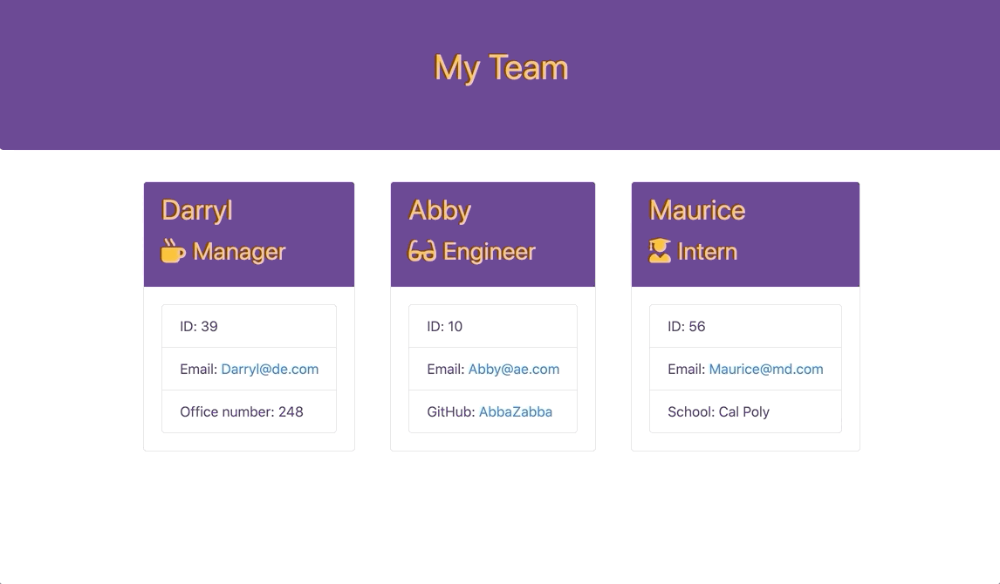
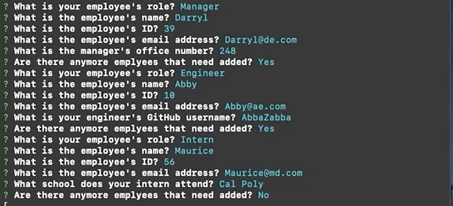

# Employee-homework9
Templete Engine - Employee Summary

## Description
This is a command line interface that will allow employers to add members to their teams. Team members will be displayed in different cards that describe their roles and other unique identifers about them.

## Instructions
In the terminal a series of questions will be asked regarding the role of the employee, their name, ID, and email. Depending on the role a seperate question will be asked. The role will be multiple choice, and the others will be input. The last question will ask if you any more employees need to be added; if yes, the process will start over and if no, the reusults will be published.

## Technolgies Used
* JavaScript
* Inquier
* Tests
* Bootstrap

